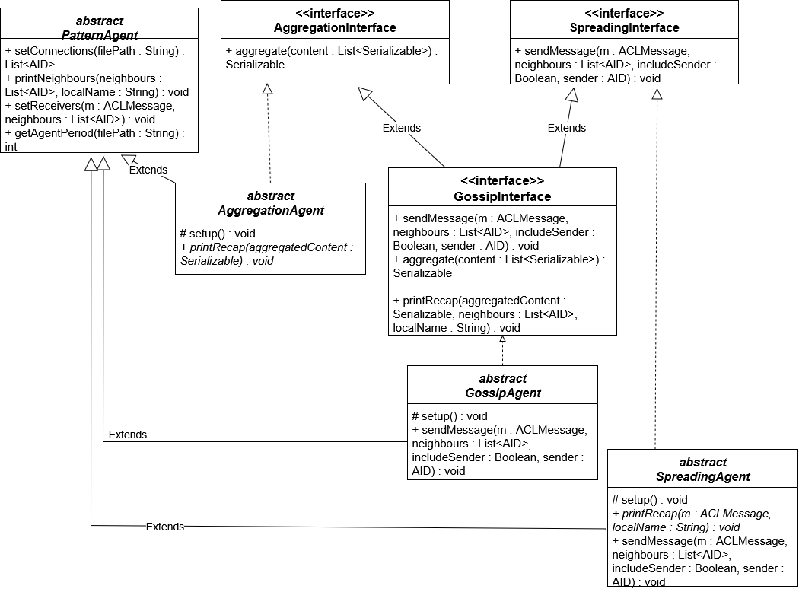

## Framework per lo sviluppo di applicazioni ad agenti auto-organizzanti mediante design pattern di ispirazione biologica

In questa repository si trova un framework che permette di sviluppare agenti che seguono alcuni pattern di comunicazione presentati da Fernandez-Marquez in "Description and composition of bio-inspired design patterns:
a complete overview".

In particolare, gli agenti sviluppati possono seguire lo Spreading Pattern, l'Aggregation Pattern e il Gossip Pattern.

## Descrizione del framework

Il framework presenta tre classi astratte, chiamate GossipAgent, SpreadingAgent e AggregationAgent, che descrivono il funzionamento di un agente che segue un determinato pattern di comunicazione, invocando alcuni metodi astratti. Presento il diagramma delle classi del framework.


Per sviluppare un agente che segua uno di questi pattern è necessario creare una classe che estenda la classe astratta che descrive il comportamento da seguire, e ridefinire alcuni metodi astratti per far sì che eseguano le azioni previste. È inoltre necessario definire un oggetto che implementi l'interfaccia Serializable che sarà il contenuto dei messaggi scambiati tra gli agenti.

## Esempi

Nella repository sono presenti due esempi:
- Termometri Intelligenti, nel package temperatureSensors. Modella il funzionamento di termometri che si scambiano la temperatura di una stanza e calcolano la media delle temperature in una casa, per mostrare entrambi i dati
- Robot Firefighters, nel package robotFirefighters. Modella il funzionamento di alcuni robot firefighters che si spostano in un edificio e comunicano tra di loro quando riescono a spegnere un incendio.


Ho aggiunto due file compile.bat e start_agents.bat per compilare ed eseguire gli esempi. Attualmente avviene l'esecuzione dell'esempio dei Robot Firefighters.

Tutte le informazioni necessarie all'avvio, come gli agenti da creare e i loro periodi, sono presenti in alcuni file di testo.
- In config.txt si specificano gli agenti da eseguire inserendo un agente per riga. La struttura è NomeAgente:package.Classe;
- In src/config/connections.txt si specificano le connessioni tra agenti. La linea Robot1: Robot2,Robot3,Robot4 indica che l'agente chiamato Robot1 può comunicare con gli agenti chiamati Robot2, Robot3 e Robot4.
- In src/config/periods.txt si specificano i periodi di esecuzione in millisecondi. La linea Robot1: 5000 indica che l'agente chiamato Robot1 ha un periodo di 5000ms
- In src/config/startingpositions.txt si specificano le posizioni di partenza dei robot firefighters. Robot1,10 indica che l'agente chiamato Robot1 partirà dalla stanza 10
- In src/config/firemap.txt si specificano le condizioni iniziali dell'edificio nell'esempio dei robot firefighters. La riga 0,true indica che nella stanza 0 è presente un incendio. La riga 1,false indica che nella stanza 1 non è presente un incendio.

## Guida all'utilizzo

Per eseguire gli esempi è sufficiente clonare la repository sulla propria macchina ed eseguire alcuni comandi.
Nella repository i file sono già configurati per l'esecuzione dell'esempio riguardante i robot firefighters.

### Macchina Windows

Per l'esecuzione degli esempi su una macchina windows, è necessario eseguire il file compile.bat e seguire le istruzioni a schermo. Successivamente, è necessario eseguire il file start_agents.bat.

È necessario configurare i file sopra descritti per eseguire ogni esempio.

### Altri sistemi operativi (Linux, MacOS)

Per l'esecuzione degli esempi su altri sistemi operativi è necessario passare il contenuto del file config.txt come argomenti a Java. Su linux e MacOS si esegue la stringa seguente in una console aperta nella cartella del framework, modificandone il contenuto.

```bash
   java -cp .:jade.jar:classes jade.Boot -gui -agents "NomeAgente1:package.Classe;NomeAgente2:package.Classe;"
 ```

 sostituendo in NomeAgente il nome dell'agente da creare, in package il nome del package che contiene la classe dell'agente e in Classe il nome della classe che descrive il comportamento dell'agente. Per esempio, per eseguire l'esempio fornito, è necessario copiare la stringa
```bash 
java -cp .:jade.jar:classes jade.Boot -gui -agents "Robot1:robotFirefighters.FireFighter;Robot2:robotFirefighters.FireFighter;Robot3:robotFirefighters.FireFighter;Robot4:robotFirefighters.FireFighter;Robot5:robotFirefighters.FireFighter;"
```

### Sviluppo di altri agenti

Per sviluppare altri agenti si consiglia vivamente l'utilizzo di un IDE come Eclipse.
Utilizzando Eclipse, è sufficiente clonare la repository e, all'avvio, aprire un progetto esistente indicizzando il framework.
La libreria JADE è già inclusa nel framework.
